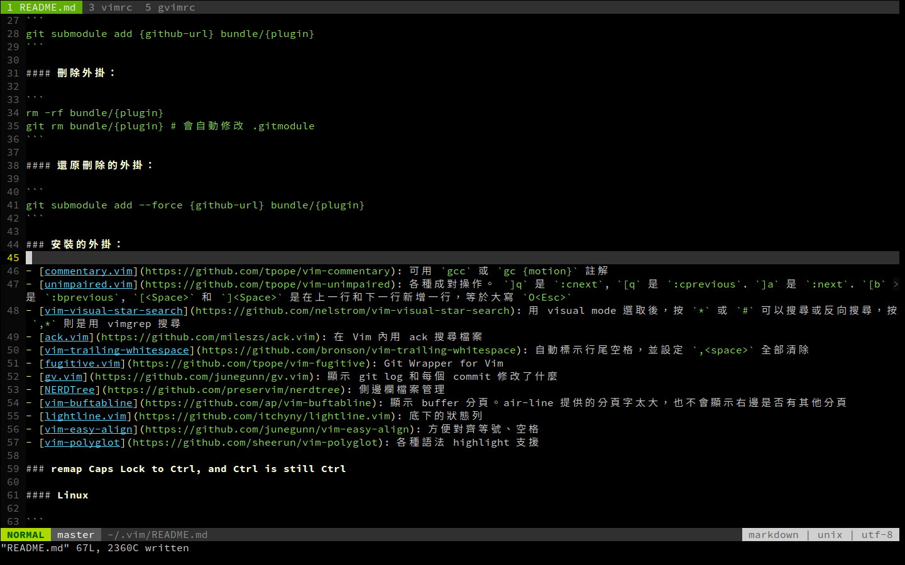

## 我的 Vim 設定和外掛



### 安裝

```
# 如果需要支援 python3，改裝 vim-gtk
git clone https://github.com/tomleesm/vimrc.git ~/.vim
ln -s ~/.vim/vimrc ~/.vimrc
ln -s ~/.vim/gvimrc ~/.gvimrc
cd ~/.vim
git submodule update --init

# install ack for ack.vim
wget https://beyondgrep.com/ack-v3.4.0 -O ack
chmod +x ack
sudo cp ack /usr/bin/
rm ack

# install exuberant-ctags
sudo apt install exuberant-ctags
```

#### 新增外掛：
```
cd ~/.vim; git submodule add {github-url} bundle/{plugin}
```

#### 刪除外掛：
```
cd ~/.vim; rm -rf bundle/{plugin}
git rm bundle/{plugin} # 會自動修改 .gitmodule
```

#### 還原刪除的外掛：
```
git submodule add --force {github-url} bundle/{plugin}
```

### 安裝的外掛：

- [commentary.vim](https://github.com/tpope/vim-commentary): 可用 `gcc` 或 `gc {motion}` 註解
- [unimpaired.vim](https://github.com/tpope/vim-unimpaired): 各種成對操作。 `]q` 是 `:cnext`, `[q` 是 `:cprevious`. `]a` 是 `:next`. `[b` 是 `:bprevious`, `[<Space>` 和 `]<Space>` 是在上一行和下一行新增一行，等於大寫 `O<Esc>`
- [vim-visual-star-search](https://github.com/nelstrom/vim-visual-star-search): 用 visual mode 選取後，按 `*` 或 `#` 可以搜尋或反向搜尋，按 `,*` 則是用 vimgrep 搜尋
- [ack.vim](https://github.com/mileszs/ack.vim): 在 Vim 內用 ack 搜尋檔案
- [vim-trailing-whitespace](https://github.com/bronson/vim-trailing-whitespace): 自動標示行尾空格，並設定 `,<space>` 全部清除
- [fugitive.vim](https://github.com/tpope/vim-fugitive): Git Wrapper for Vim (只是為了在 lightline 顯示分支名稱)
- [delimitMate](https://github.com/Raimondi/delimitMate): 自動補齊括號和引號。`<Shift><Tab>` 移動游標到自動補齊的括號或引號之後
- [vim-sql-syntax](https://github.com/shmup/vim-sql-syntax): SQL highlight
- [php.vim](https://github.com/StanAngeloff/php.vim): PHP highlight
- [NERDTree](https://github.com/preservim/nerdtree): 側邊欄檔案管理
- [vim-buftabline](https://github.com/ap/vim-buftabline): 顯示 buffer 分頁。air-line 提供的分頁字太大，也不會顯示右邊是否有其他分頁
- [lightline.vim](https://github.com/itchyny/lightline.vim): 底下的狀態列
- [eunuch.vim](https://github.com/tpope/vim-eunuch): Linux 檔案的簡便刪除、改名、移動等操作
- [vim-easy-align](https://github.com/junegunn/vim-easy-align): 方便對齊等號、空格

### remap Caps Lock to Ctrl, and Ctrl is still Ctrl

#### Linux

```
sudo vim /etc/default/keyboard
新增 XKBOPTIONS="ctrl:nocaps"
重新啟動系統
```
